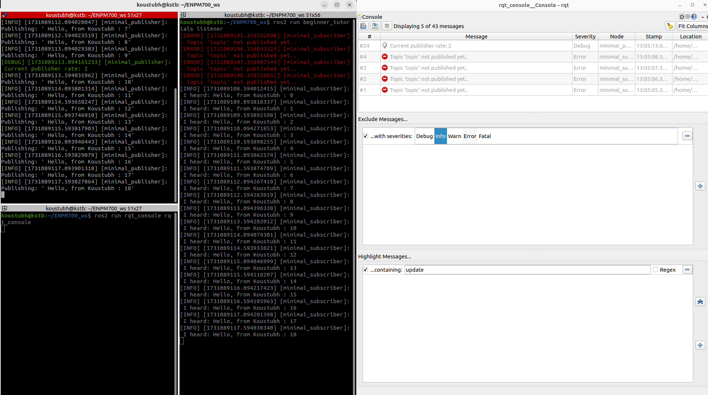

# My_Beginner_Tutorials

## Overview

This project contains a simple package to demonstrate publisher and subscriber node in ROS2 humble.
Note: The output from cpp-lint is stored in the reports directory

## Author

Koustubh (<koustubh@umd.edu>)

## Prerequisites

Please make sure that you have the follwing setup as a prerequisite for building and running this package

- Ubuntu 22.04
- ROS2 Humble
- colcon
- clang tools

## Cloning and Building the package

1. Source ROS2 underlay

   ```bash
   source /opt/ros/humble/setup.bash
   ```

2. Create new workspace

   ```bash
   mkdir -p ~/ros2_ws/src
   cd ~/ros2_ws/src
   ```

3. Clone the repository 

   ```bash
   git clone https://github.com/koustubh1012/my_beginner_tutorials.git
   ```

4. Resolve missing dependencies

   ```bash
   cd ..
   rosdep install -i --from-path src --rosdistro humble -y

   ```

5. Build the workspace with colcon build

   ```bash
   colcon build
   ```

6. Source Overlay

   ```bash
   source install/setup.bash
   ```

## Running the Nodes

### 1. Run the talker node

```bash
ros2 run beginner_tutorials talker
```

You can also pass the publishing rate using CLI. To modify the rate of publishing to 1.0 Hz, run the following command

```bash
ros2 run beginner_tutorials talker --ros-args -p freq:=1.0
```

NOTE: Pass the frequency parameter as a double

### 2. Run the listener node

Open another terminal and run the following commands

```bash
# Source underlay
source /opt/ros/humble/setup.bash

# Source overlay
cd ~/ros2_ws
source install/setup.bash

# Run the Subscriber node
ros2 run beginner_tutorials listener
```

### 3. Using service to modify the output string in talker node

If you want to modify the string output from talker node, it can be done by using a service called "modify_string".
The service accepts an input string as a request and returns the same string as a response.

To call the service, you can use ROS2 CLI or a service client node.

Using ROS2 CLI, run the following command

```bash
# Usage: ros2 service call /modify_string beginner_tutorials/srv/ModifyString "{input: '<Your_String>'}"
ros2 service call /modify_string beginner_tutorials/srv/ModifyString "{input: 'John Doe'}"
```

To call the service via a client node, run the following command

```bash
# Usage: ros2 run beginner_tutorials client "<Your_String>" 
ros2 run beginner_tutorials client "John Doe"
```

## Using ROS2 launch file

You can use a launch file to launch both the talker and listener nodes at the same time. The launch files launches the talker node with a default frequency of 2 Hz

```bash
ros2 launch beginner_tutorials talker_listener_launcher.launch.py 
```

As we know, the talker node has a parameter called 'freq' that can be used to set the frequency of publishing in Hz, we can use the following command to launch the nodes as well as set the frequency using launch files.

The below command will start the node with a frequency of 5.0 Hz

```bash
# Usage: ros2 launch beginner_tutorials talker_listener_launcher.launch.py freq:=<New_Frequency>
ros2 launch beginner_tutorials talker_listener_launcher.launch.py freq:=5.0
```

## ROS2 Logging demo

In the given nodes, I have implemented various levels of logging. In the screenshot below, we can see that there are DEBUG and ERROR level logs registered in rqt_console.



The warning message is generated because the listener node is run before the talker node and it's not able to find the subscribed topic.

I have also printed out a DEBUG log giving out the current publisher rate.

## ROS2 Resource

More ROS2 resources can be found at [ROS2 tutorials](https://docs.ros.org/en/humble/Tutorials.html) page
